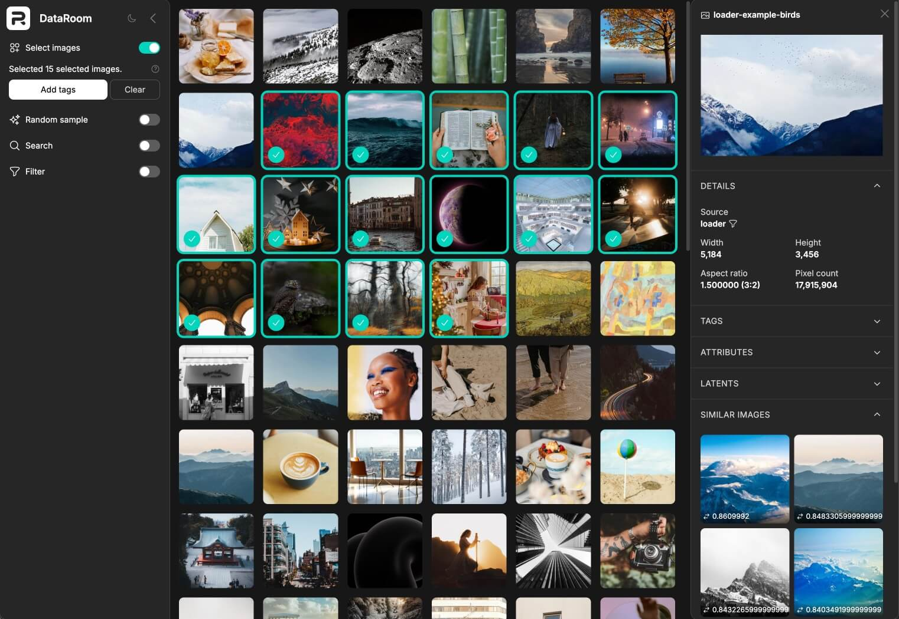

# DataRoom



[](https://github.com/Photoroom/dataroom/actions/workflows/test.yml)

DataRoom is a high-performance AI training data management platform featuring a beautiful UI, multimodal support (images, latents, masks), similarity search, and a Python client for seamless integration.

To try it out, follow the guide below. Also check out the Python client inside [dataroom_client](./dataroom_client) and the examples in [notebooks](./notebooks).

## Getting Started

The simplest and fastest way to get a Dataroom stack up and running is to use Docker. If you prefer to run it without Docker, see section [Setup without Docker](#setup-without-docker).

```bash
cp .env.example .env
cp backend/config/settings/local.example.py backend/config/settings/local.py
```

### Build and Start Services

The following command builds and starts the Django, Postgres and OpenSearch containers:
```bash
docker compose up -d --build
```

### Collect Static Files
The static files are built as part of the Django docker. To collect them, we run:
```bash
docker compose run --rm dataroom_django python manage.py collectstatic --link --clear --noinput
```

### Run Database Migrations

```bash
docker compose run --rm dataroom_django python manage.py migrate
```

### Setup OpenSearch Indices

```bash
docker compose run --rm dataroom_django python manage.py setup_opensearch --confirm
```

### Create admin user

```bash
docker compose run --rm dataroom_django python manage.py createsuperuser --noinput --email admin@photoroom.dev
```

### Access the application
Go to http://localhost:8000 and login with `admin@photoroom.dev` / `admin`

Quick overview:
- **Full Application**: http://localhost:8000 (Django serves pre-built React frontend)
- **Django Admin**: http://localhost:8000/admin/
- **API Docs**: http://localhost:8000/api/docs/
- **OpenSearch**: http://localhost:9200

## Local Development

For active frontend development with instant Hot Module Replacement (HMR):

### Prerequisites
- Node.js 22.14.0: `nvm use 22.14.0`
- npm 10.9.2

### Setup

**1. Install Node.js version from `.nvmrc`:**
```bash
nvm install && nvm use
```

**2. Install frontend dependencies:**
```bash
npm install
```

**3. Enable development mode in Django settings.**

Update `backend/config/settings/local.py`:
```python
# FRONTEND
# ------------------------------------------------------------------------------
DJANGO_VITE_DEV_MODE = True
```

**4. Start frontend dev server locally:**
```bash
npm run dev  # Runs on port 3000

# For port conflicts, override the port:
npm run dev -- --port 3001  # or any available port
```

**5. Rebuild and start Django, Postgres and OpenSearch containers:**
```bash
docker compose up -d --build
```
See [Backend setup](#backend-setup) if you like to run the Django backend locally without Docker.

### Run Tests
Run all the backend tests inside of the Django docker:
```bash
docker compose run --rm dataroom_django pytest
```

### Pre-commit Hooks
Please install the pre-commit hooks for maintaining code quality:
```bash
pre-commit install --hook-type pre-commit
```

### Other Useful Commands
Run production server:
```bash
docker compose run --service-ports dataroom_django ./scripts/run_web.sh
```

Run production background tasks:
```bash
docker compose run --service-ports dataroom_django ./scripts/run_tasks.sh
```

Reset database:
```bash
docker compose exec dataroom_postgres bash -c "su postgres -c 'dropdb dataroom && createdb dataroom'"
```

View logs:
```bash
docker compose logs -f dataroom_django
```

Restart specific service:
```bash
docker compose restart opensearch
```

Update poetry lock file after adding new dependencies to `pyproject.toml`:
```bash
./scripts/poetry-lock.sh
```

### Static files in production

- The entries in `rollupOptions` inside [vite.config.js](./vite.config.js) define which entry points are going to be built.
- Anything inside [/frontend/public/](./frontend/public) will simply be copied over. Use this for images included in the HTML.
- Running `npm run build` builds and bundles the frontend, generating a `manifest.json`.
- Built files are now ready in `/backend/static_built/`.
- Running `python manage.py collectstatic` collects the static files, runs whitenoise, compressing and adding a hash to the filename.
- Final static files are now ready to be served from `/backend/static_collected/`.


## Setup without Docker

<details>
  <summary>If you prefer to run the project on MacOS without Docker, follow these steps.</summary>

### Prerequisites

Install these prerequisites:

- `python@3.13.0`
- `virtualenv` https://virtualenv.pypa.io/en/latest/installation.html
- `poetry@2.0.1` https://python-poetry.org/docs/#installation
- `nvm` https://github.com/nvm-sh/nvm
- Postgres v16 https://postgresapp.com/
- `brew install snappy`

To use homebrew's openssl and snappy, add the following to your `.zshrc`:

```
export LDFLAGS="-L/opt/homebrew/opt/openssl@3/lib -L/opt/homebrew/Cellar/snappy/1.1.10/lib"
export CPPFLAGS="-I/opt/homebrew/opt/openssl@3/include -I/opt/homebrew/Cellar/snappy/1.1.10/include"
```

### Database setup

Create the database:

```
createdb dataroom
```

Run OpenSearch:

```
docker compose up opensearch
```

```
python manage.py setup_opensearch
```

### Backend setup

Use the correct python version from `.python-version`:

```
brew install pyenv
pyenv init
pyenv install
pyenv local
```

To create a virtualenv, inside the root project folder, run:

```
virtualenv .venv
```

To install all python requirements:

```
pip install poetry==1.7.1
poetry install
```

Copy and enable local settings:

```
cp backend/config/settings/local.example.py backend/config/settings/local.py
```

Remember to update the `DATABASES` settings in `backend/config/settings/local.py` to match your local database.

After setting up frontend, build the static files once:

```
npm run build
```

Collect the static files:

```
python manage.py collectstatic --link --clear --noinput
```

</details>
